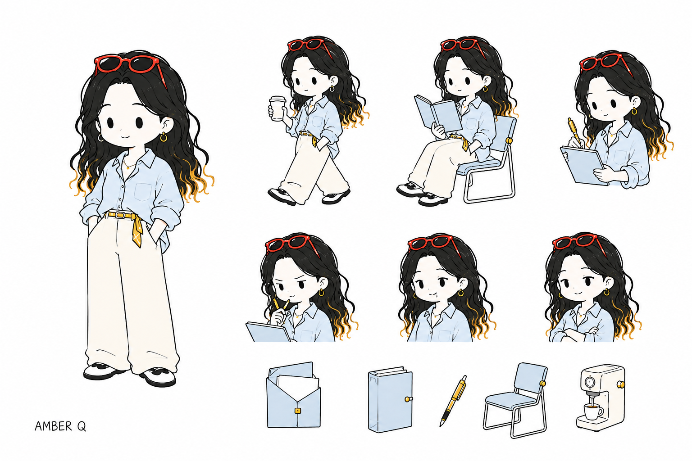

# Amber Illustrations Skill

用 Amber 个人 IP 为中文文章、博客、知识手册和方法论内容生成统一的 16:9 白底手绘正文配图。



## 它能做什么

- 阅读中文正文，找出真正值得视觉化的认知锚点。
- 先规划 4–8 张 shot list，说明插入位置、核心意思、构图和角色动作。
- 将流程、关系、状态和抽象概念转化为简单、清楚、略带趣味的视觉隐喻。
- 使用固定的 Amber Q 版角色、浅蓝／奶油白／明黄元素系统和红色墨镜识别点。
- 检查人物一致性、文字错误、画面密度和 PPT 感，并指导迭代。

## 视觉语言

- Amber：约 3–3.25 头身，红色墨镜、黑金卷发、浅蓝宽松衬衫、奶油白阔腿裤。
- 元素：浅蓝块面、奶油白主体、明黄连接点与路径。
- 线条：人物与物件使用相同的纤细手绘线和简化程度。
- 版式：16:9、纯白背景、大量留白、一图一个认知动作。

## 示例

### Token、Prompt 与 LLM


### Context 与 Memory


### Skill、Function Calling、RAG 与 MCP


完整案例见 [《AI 术语速查手册》Amber 配图版](examples/AI术语速查手册-Amber配图版.md)。

## 安装

将 `amber-illustrations/` 整个目录复制到 Codex skills 目录：

```text
~/.codex/skills/amber-illustrations/
```

安装后，在新的对话中调用：

```text
使用 $amber-illustrations，为下面这篇中文文章规划并生成 5 张正文配图。
```

也可以只生成 shot list：

```text
使用 $amber-illustrations，先不要生图。分析文章中值得配图的段落，并输出 shot list。
```

## 目录结构

```text
amber-illustrations-skill/
├── amber-illustrations/
│   ├── SKILL.md
│   ├── agents/openai.yaml
│   ├── assets/amber-character-reference.png
│   └── references/
├── examples/
│   ├── ai-terms/
│   └── AI术语速查手册-Amber配图版.md
├── LICENSE
└── ASSET_LICENSE.md
```

## 授权

- Skill 指令和文本代码采用 [MIT License](LICENSE)。
- Amber 角色设计、角色参考图和示例插画不包含在 MIT 授权中，详见 [ASSET_LICENSE.md](ASSET_LICENSE.md)。

## 作者

Amber · GitHub [@AmberCrissy](https://github.com/AmberCrissy)
