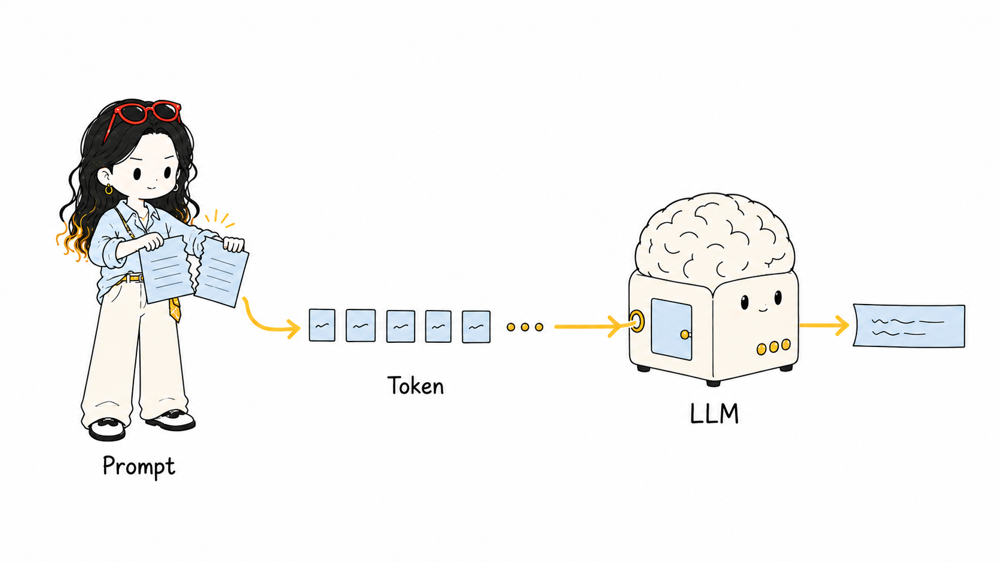
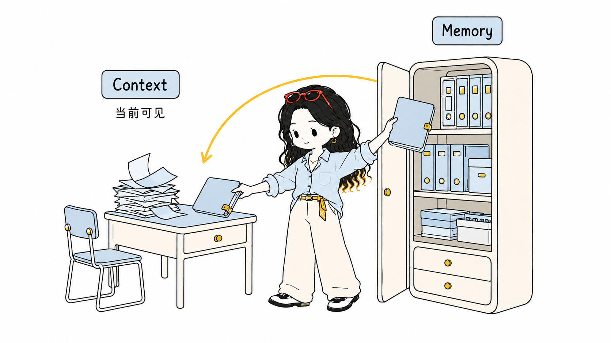
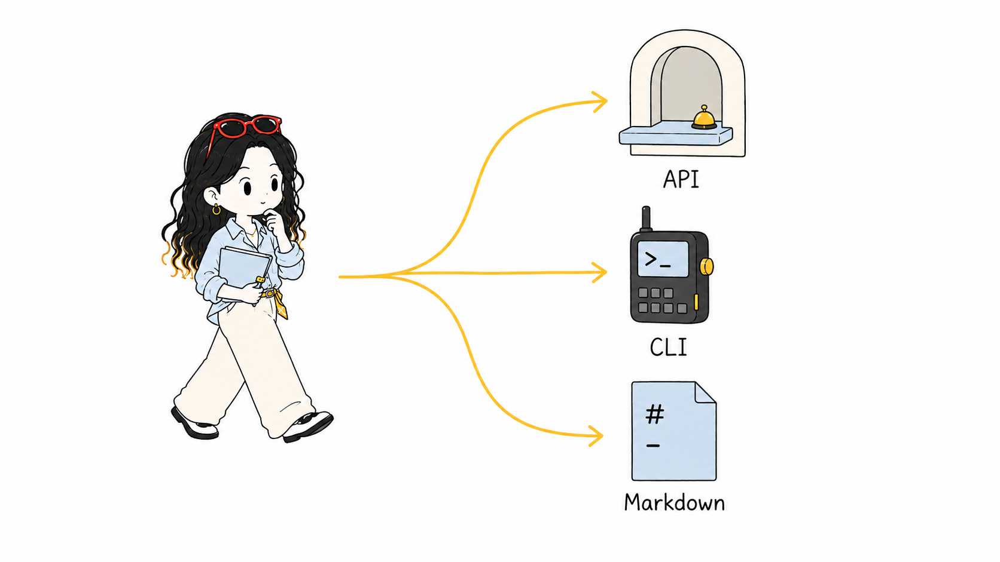
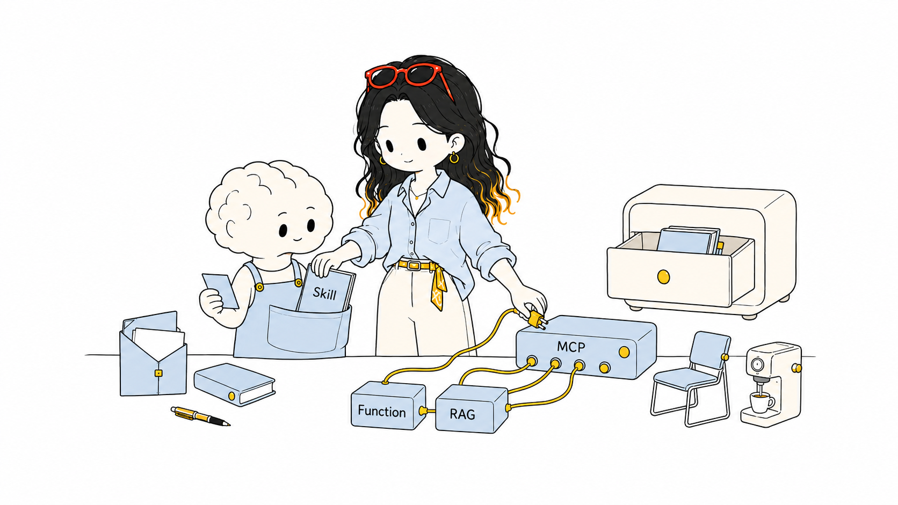
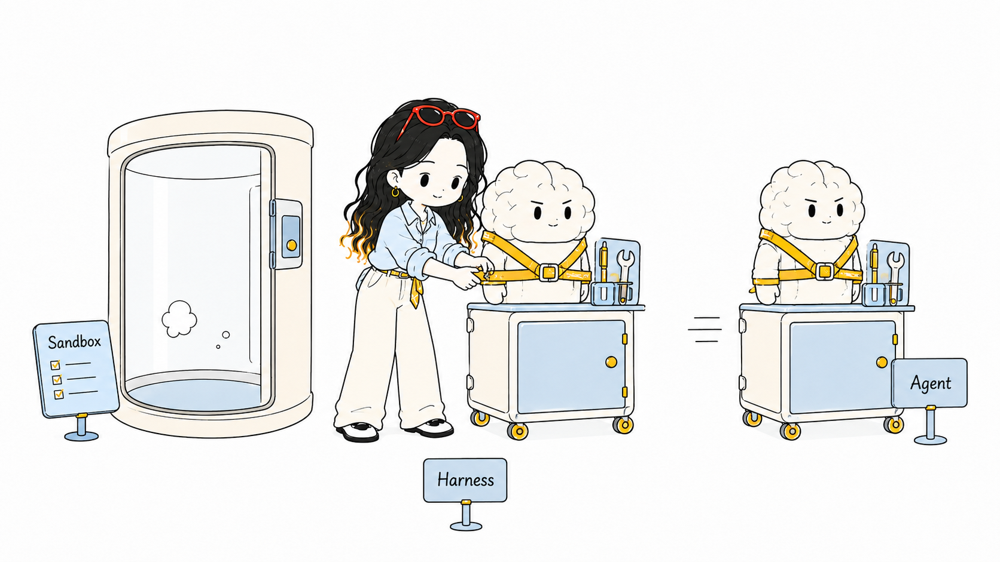

# AI术语速查手册（小白秒懂版）

> 15个AI核心术语，按从基础到进阶排列，每个词用"一句话定义 + 大白话原理 + 一秒get的比喻"讲透，全部放在同一家公司的场景里。

---

## 排序一览

| # | 术语 | 一句话定位 |
|---|------|-----------|
| 1 | Token | 模型处理信息的最小单元 |
| 2 | LLM | 大语言模型 |
| 3 | Prompt | 给模型的指令 |
| 4 | Context | 模型当前"看到"的上下文 |
| 5 | Memory | 模型的长期记忆 |
| 6 | API | 标准化接口 |
| 7 | CLI | 命令行界面 |
| 8 | Markdown | 轻量级标记语言 |
| 9 | Skill | 模型加载的专用技能 |
| 10 | Function Calling | 模型调用外部工具 |
| 11 | RAG | 检索增强生成 |
| 12 | MCP | 模型上下文协议 |
| 13 | Agent | 智能体 |
| 14 | Sandbox | 隔离执行环境 |
| 15 | Harness | 工程化框架 |

---

## 逐一讲解

### 1. Token（词元）

- **精简定义：** 模型处理信息的最小基本单元，是计量尺子，不是算力。
- **大白话原理：** 模型看不懂整段话，它把文字切成一块一块的"格子"来读。中文一个常用词可能被切成一个格子，一个生僻字或标点反而可能占两个格子。你付钱按"切了多少格子"算，不是按"写了多少字"算。
- **秒懂比喻：** Token 就是稿纸上的格子。字数不算钱，格子才算钱。

### 2. LLM（大语言模型）

- **精简定义：** 在海量文本上训练出来的、能理解和生成自然语言的大型神经网络模型。
- **大白话原理：** 你喂它几千亿字的书和网页，它学会了"下一个词最可能是什么"。然后你给它一句话开头，它就顺着往下接。接得多了，看起来就像"懂"了。
- **秒懂比喻：** LLM 就是一个状元实习生——脑子极好，但还没给工位、没给工具、没给权限，光有脑子啥也干不了。

### 3. Prompt（提示词）

- **精简定义：** 用户输入给大模型的指令或问题，用于引导模型输出期望的结果。
- **大白话原理：** 模型不会主动干活，你给它什么指令，它就按什么方向接话。指令写得越清楚，它答得越好。写模糊了，它就瞎猜。
- **秒懂比喻：** Prompt 就是老板贴在实习生桌上的工单便签。活儿干得好不好，七分看这张便签写得清不清楚。

### 4. Context（上下文）

- **精简定义：** 模型在一次对话中能"看到"的全部历史消息和当前输入。
- **大白话原理：** 模型每次回答时，只能看到它"当前桌上摊着"的那些东西——你的最新问题 + 之前的对话记录。东西太多塞不下了，最老的就会被挤出去。
- **秒懂比喻：** Context 就是实习生桌面摊开的文件堆。桌面就那么大，塞满了就得扔旧的，扔了就忘了。

### 5. Memory（记忆）

- **精简定义：** 大模型系统中用于在多次对话或任务间持久化存储和检索信息的机制。
- **大白话原理：** Context 是桌面，Memory 是档案柜。桌面（Context）满了会丢东西，但档案柜（Memory）可以长期保存。模型回答时，先去档案柜翻一下有没有相关旧资料，贴到桌面上再读。
- **秒懂比喻：** Memory 就是档案柜 + 笔记本。Context = 桌面，Memory = 柜子。桌面会清空，柜子不会。

### 6. API（应用程序编程接口）

- **精简定义：** 一套标准化的接口规范，允许不同软件系统之间互相调用和交换数据。
- **大白话原理：** 你不需要知道厨房怎么炒菜，只需要看菜单点菜，服务员（API）就把需求传给厨房，厨房做好端出来。API 就是那个"标准化办事窗口"，你按规矩提需求，对方按规矩给结果。
- **秒懂比喻：** API 就是餐厅的标准化办事窗口。你不用进厨房也能点菜，点完等上菜就行。

### 7. CLI（命令行界面）

- **精简定义：** 通过键盘输入文本命令来操作计算机系统的用户界面。
- **大白话原理：** 没有鼠标没有按钮，全靠自己敲文字指令。敲对了就执行，敲错了就报错重来。好处是一行搞定复杂操作，坏处是记不住命令就抓瞎。
- **秒懂比喻：** CLI 就是对讲机 / 黑框框。一行指令搞定，错一个字重来。老手最爱，新手最怕。

### 8. Markdown（.md 文件格式）

- **精简定义：** 一种轻量级标记语言，用简单的符号实现文本排版（标题、列表、加粗等），文件后缀为 .md。
- **大白话原理：** 不用 Word 那种点菜单调格式，直接用符号标记。写 `# 标题` 就是大标题，`- 列表` 就是项目符号，`**加粗**` 就是加粗。AI 最熟悉的排版方式，写出来直接能看，转 PDF/网页都方便。
- **秒懂比喻：** Markdown 就是带暗号的便签。写上 `#` 别人就知道这是标题，写上 `-` 别人就知道这是列表。穷人的 Word，AI 的母语排版。

### 9. Skill（技能）

- **精简定义：** 在大模型应用中，为模型附加的专用知识或操作手册，使其能完成特定领域的任务。
- **大白话原理：** 模型本身是通才，但加了某个 Skill 就等于给了它一本"领域专用手册"。比如市场调研 Skill 里写了行业术语、分析框架、报告模板，模型拿到手就能按规范出报告。
- **秒懂比喻：** Skill 就是上岗证 + SOP 操作手册。通用脑子 + 专用手册 = 能顶岗。没手册的状元只是状元，有手册的状元才是"市场调研专员"。

### 10. Function Calling（函数调用）

- **精简定义：** 大模型根据用户意图自动生成函数调用请求，由外部程序执行实际操作的机制。
- **大白话原理：** 模型不会自己跑代码、查数据库、调接口，但它能识别出"你需要我干什么"，然后写一张"申请单"（函数调用），把参数填好交给系统去执行。执行完把结果拿回来，再回复你。
- **秒懂比喻：** Function Calling 就是举手填申请单。实习生只负责写单子、填参数，跑腿干活的是别人（系统）。

### 11. RAG（检索增强生成）

- **精简定义：** 在模型生成回答之前，先从外部知识库检索相关信息，将检索结果作为上下文输入模型，从而提升回答的准确性和时效性。
- **大白话原理：** 模型训练数据有截止时间，不知道最近发生的事。RAG 就是回答前先"翻资料"——去知识库/互联网搜一下最新信息，把相关内容贴到桌面上，再让模型基于这些新资料答题。
- **秒懂比喻：** RAG 就是先翻资料再答题。开卷考试永远比闭卷靠谱。模型不是什么都知道，但有了资料库当"开卷"，答得就准多了。

### 12. MCP（模型上下文协议）

- **精简定义：** 一种标准化的协议，用于统一模型与外部工具、数据源之间的连接方式，让模型能通过通用接口调用各种第三方服务。
- **大白话原理：** 以前每个工具都有自己的接口格式，模型要接一个工具就得写一套专用代码。MCP 把它标准化了——所有工具都按同一个"插座标准"来设计，模型只要有一个"万能插头"就能接任何工具。
- **秒懂比喻：** MCP 就是万能插座 / USB-C。以前每个设备一个专属插头，现在统一一个口，插上去就能用。

### 13. Agent（智能体）

- **精简定义：** 基于大模型构建的、能自主感知环境、规划任务、调用工具并执行多步操作以达成目标的智能系统。
- **大白话原理：** Agent = Model（脑子）+ Harness（工位系统）。光有脑子（LLM）不行，还得有手（工具调用）、有流程（任务规划）、有权限（API 访问）、有责任心（目标驱动）。把这些全串起来，模型就从"能聊天的聊天机器人"变成了"能独立扛项目的员工"。
- **秒懂比喻：** Agent 就是能独立扛项目的员工。不是接一句答一句的客服，而是你给个目标，他自己拆任务、找资料、调工具、改到满意再交差。

### 14. Sandbox（沙盒）

- **精简定义：** 一种隔离的、受限的执行环境，允许代码或操作在其中安全运行而不影响外部系统。
- **大白话原理：** 模型（或 Agent）有时候要跑代码、调外部服务，这些操作有风险——代码可能写错、可能删错东西。沙盒就是一个"防爆间"：允许他犯错，但不允许他伤到公司。在里面随便搞，炸了重启就行。
- **秒懂比喻：** Sandbox 就是公司的防爆试做间。实习生可以在里面随便试、随便炸，但出了这间房就不行了。权限管理决定"能做什么"，沙盒决定"在哪做"，人工审批决定"高危动作确认"——三者合起来才是完整安全体系。

### 15. Harness（工程化框架）

- **精简定义：** 包裹在模型之外的全部工程层总和，包括工具管理、权限控制、安全护栏、评测打分等，决定模型能否真正落地使用。
- **大白话原理：** 黄金公式：Agent = Model + Harness。Model 决定上限（脑子有多聪明），Harness 决定落地（能不能真的干活）。它包括：工位配置（工具/权限）、缰绳（安全护栏，不许说什么/做什么）、考核台（评测打分，决定留不留）。
- **秒懂比喻：** Harness 就是"工位 + 缰绳 + 考核台"。同一个实习生（Model），给不同的工位配置、不同的权限、不同的考核标准，就能变成完全不同的员工（Agent）。差别不在脑子，在工位配置。
- **纠偏提醒：** Harness ≠ 枷锁。原意是马具、缰绳、挽具（harness the power = 驾驭力量）。"不许说什么"那是 guardrail（安全护栏），只是 harness 里的一个小组件。另外，评测 Harness（如 `lm-evaluation-harness`）是发动机测试台架/标准考场，Agent Harness 是工位系统，别混。

---

## 串起来：一个真实任务，15个词全过一遍

> **目标：出一份"潮州牛肉丸竞品价格报告"。**
>
> 你在 **CLI** 黑框框里敲下一行 **Prompt** → 文字被切成 **Token** 送进去，**LLM**（实习生）开始接话 → 桌上摊着的是 **Context**，去年那份旧报告从 **Memory**（档案柜）抽出摘要贴上桌面 → 还不够新，他去知识库 **RAG** 翻出最新报价页 → 要实时价格？他填一张 **Function Calling** 申请单，走的是 **MCP** 这个万能插座接进来的电商工具 → 他不只答一句，而是拆任务、循环查、反复改，此时他已经是 **Agent** → 要跑分析代码？丢进 **Sandbox**（防爆间），炸了不影响生产库 → 报告用 **Markdown** 排版，他能干这活因为加载了《市场调研 **Skill**》 → 而他用到的窗口、档案柜、插座、防爆间、打分机制——这一整套，就是 **Harness**。月底你用评测 Harness 给他打分，决定留不留。

---

## 最容易混的六对（考前必看）

| 容易混淆的一对 | 本质区别 |
|---|---|
| Token vs 算力 | 度数 vs 马力（token 是计量尺子，算力是干活的马力） |
| Token vs 字数 | 模型切的格子 vs 人数字数 |
| Context vs Memory | 桌面 vs 档案柜 |
| Function Calling vs MCP | 私有申请单 vs 通用插座标准 |
| Agent vs Harness | 员工 vs 工位系统（Agent = Model + Harness） |
| Guardrail vs Harness | 不许说什么（小组件） vs 整套底座 |

---

*本手册按从基础到进阶排列，全部术语统一放在"开公司招超级实习生"的场景中，方便小白一秒 get。*
